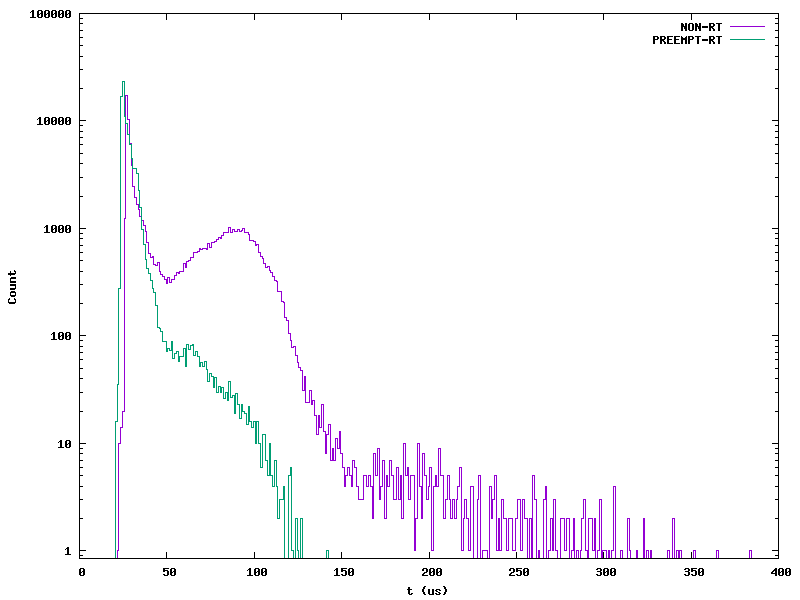
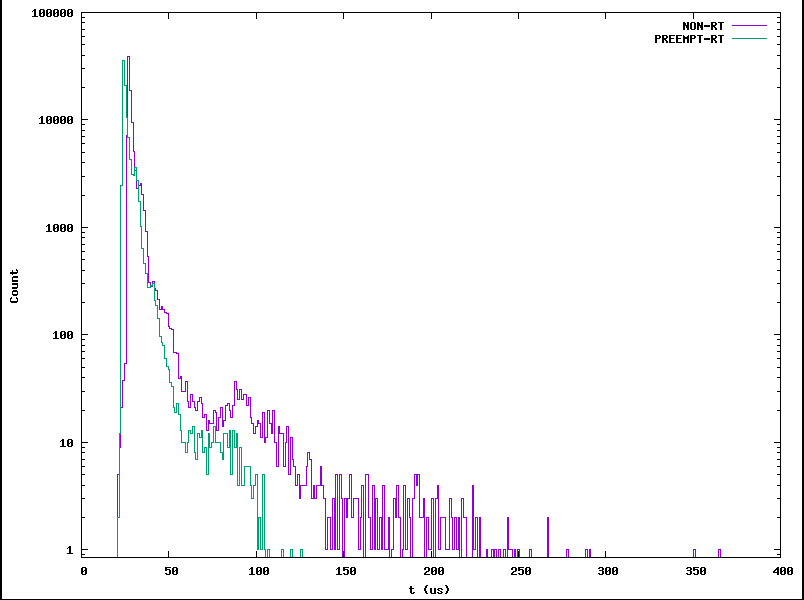

# HW06
1. Where does Julia Cartwright work?  
  - She works at National Instrument  
2. What is PREEMT_RT? Hint: Google it.  
  - It is a real-time kernel patch. It makes interrupts run as threads.    
3. What is mixed criticality?   
  - It is when time-sensitive processes and non-time-sensitive processes need to run together. 
4. How can drivers misbehave?   
  - They can misbehave by having too many register writes in a row.  
5. What is Δ in Figure 1? 
  - It stands for the time between the events and the service happening.  
6. What is Cyclictest[2]?  
  - It measures the difference between a thread's wake-up time and the time it actual wakes up.
7. What is plotted in Figure 2?  
  - Its the delta of the linux system and the delta measured with PREMMT_RT.
8. What is dispatch latency? Scheduling latency?   
  - It is the time between the hardware interrupt and the wake up time of the thread. Scheduling latency is the time between the scheduler being aware of a task and the time that the processor actually does the task. 
9. What is mainline?  
  - It shows how the cpu switches between threads. 
10. What is keeping the External event in Figure 3 from starting?  
  - The current executing irq isn't done. 
11. Why can the External event in Figure 4 start sooner?  
  - Because of the few codes in the irq. This means the external thread can be worken up earlier. 

## RT vs non-RT
### Without load
  
### With load
  
- RT has a bounded latency of around 100us. I ran the make and make clean commands shown in exercise 36.

# hw06 grading

| Points      | Description | |
| ----------- | ----------- |-|
|  2/2 | Project | *Stacker Arcade Game*
|  4/5 | Questions | *Mainline is the main kernel tree.*
|  4/4 | PREEMPT_RT
|  2/2 | Plots to 500 us
|  5/5 | Plots - Heavy/Light load | *Ithink your plots are swapped*
|  2/2 | Extras
| 19/20 | **Total**

*My comments are in italics. --may*