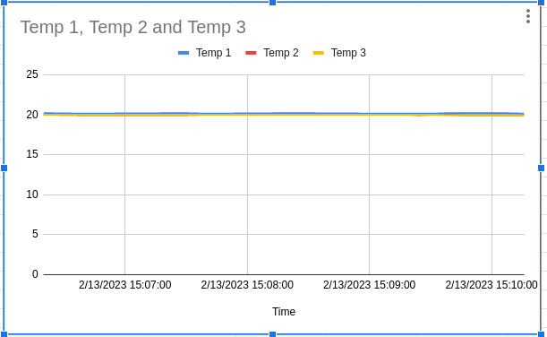

# Homework 9

## Project Timeline
- Created a timeline for the final project.
- Link: https://github.com/rhit-wendella/Stack_game_project

## MAX31820 temp sensors
- The file 1wire_temp.py reads the temp sensors using python.

## Logging in sheets
- Created a python file to read the temperature and put it into a google sheet. The file to run is temp_sheets.py.
- Link to Sheet: https://docs.google.com/spreadsheets/d/1Cae-zzcrN9eBKBVuVuD-c7hN_qFZyAnnCfQ3QhCEokI/edit?usp=sharing

# hw09 grading

| Points      | Description | |
| ----------- | ----------- |-|
|  5/5 | Timeline |
|  3/3 | MAX31820 working
| 12/12| Logging to Sheets
| 20/20| **Total**

*My comments are in italics. --may*

